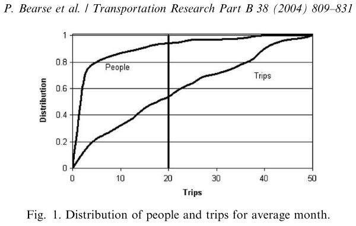
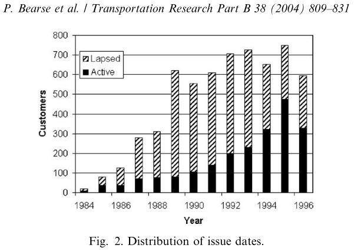

```{r setup, include=FALSE}
biblio <- bibtex::read.bib("bibliography.bib")
knitr::opts_chunk$set(echo = TRUE)
```

# Microsimulation
Buzz words: multi-agent, microsimulation model, on-demand, agent-based, carpooling, travel 
demand/supply estimation, taxi fleets, demand-responsive transportation, case study,

## Autonomous Taxicabs in Berlin – A Spatiotemporal Analysis of Service Performance
`r capture.output(print(biblio["BischoffJ2016"]))`

### Abstract


### Notes

They tested the effect on traffic from empty cars and demand shift as people switch from 
public transit.

They show how they scale from the 100% base scenario to the 10% without describing how they 
scaled down trip rates and network capacity (maybe described in previous paper).

Helpful graphics include the passenger waiting times during time of day, the productivity of 
the vehicles during time of day, and spatial distribution of waiting times and empty rides.

They found 10% of transit riders switched to autonomous taxis (only measured on the city center 
model, no outskirts). No explanation was given.


## Simulation of city-wide replacement of private cars with autonomous taxis in Berlin 
`r capture.output(print(biblio["Bischoff2016"]))`

### Abstract

### Notes
Goal is to find optimum number of autonomous taxis (ATs) to service the city of Berlin, by 
replacing the private cars. They came up with 100,000 (not sure how exactly)

Details include the dispatching strategy using the demand-supply balancing strategy, _undersupply_ 
and _oversupply_.

I think the dispatch algorithm should include a buffer distance around the request. The model 
should be seen from the customer's perspective.

Data not supported...
- The split of car and public transit.
- Section 3.2, certain adaptations pertaining to shortest path search...
- What are taxi ranks (section 4)
- 4.2, the graphs all look the same, and they don't talk about why 100,000 vehicles were chosen. 
"It was a good compromise..."
- 4.3 the Replacement ratio... is it 1:10 or 1:12?
- 4.3.2 where did they get the 40 min utilization of CDVs?
- Conclusion, total drive time? what is it?

## Simulating a rich ride-share mobility service using agent-based models
`r capture.output(print(biblio["Segui-Gasco2019"]))`

### Abstract
In the UK, and using the National Trip End Model (NTEM), they produced a set of O-D matrices and 
then integrated them into MATSim. MATSim was used to predict the changes in travel behavior 
(specifically mode shift) and predict the effect on traffic conditions due to new AMoD services 
for the year 2025. As part of their agent-based framework, the Value of Time changes depending 
on the purpose of each trips and the income of the traveler.

MATSim is used to calculate the service demand, however, neither the occupancy of each vehicle 
and waiting/detour time were known. Average values were used and held constant (IMSim could have 
precisely calculated those values, but it would have taken a lot of time...).

MATSim informs the IMSim about the network conditions (travel times) and origins and destinations. 
With this input, IMSims calculates the optimum routes for the AMoD fleet, while simultaneously 
tracking the waiting and detour times that each agent experiences. "This information" (not 
exactly sure what is included here) is reported back to MATSim which updates the perception 
score of the agents and the Passenger Car Unit factor.

Then they calibrate it to the MERGE Greenwich case study in London.

### Notes
In London, using MATSim (demand simulation model) coupled with IMSim (Intelligent mobility simulator)

Includes a literature review that describes several authors' efforts.

OD trips had to be disaggregated? What does that mean? Each trip was assigned information regarding 
the purpose, departure time, and initial mode of transport before the introduction of AV ride-sharing. 
The Value of Time (VoT) for each trip was also included together with demographic characteristics.

the original transport demand derives from a trip-based model, no information can be extracted 
regarding the sequence of activities (trip-chaining). Instead, all plans were expressed as two 
activities: one at the origin and one at the destination, linked by an intermediate trip.


## Microsimulation of Demand and Supply of Autonomous Mobility On Demand
`r capture.output(print(biblio["Azevedo2016"]))`

### Abstract
Using SimMobility, they integrate mobility sensitive behavioral models in a multiple time-scale 
structure. They look at three simulation levels a) long-term, b) a midterm level, and c) a 
short-term level.

### Notes
Professors from the MIT-Singapore alliance. 


## TaxiSim: A Multiagent Simulation Platform for Evaluating Taxi Fleet Operations
`r capture.output(print(biblio["Cheng2011"]))`

### Abstract
They *build* a multi-agent-base simulation platform, TaxiSim.

### Notes
"Despite all these efforts in building computer simulations
for a wide range of studies, to the best of our knowledge, we cannot find any simulation platform 
that is capable of modeling realistic taxi fleet operations. Taxi fleet operation is special and 
cannot be modeled straightforwardly by using existing technologies for the following reasons: [Taxi 
drivers make decisions "selfishly" and taxi drivers act unpredictably after they drop off a customer.]"


## Output variability caused by random seeds in a multi-agent transport simulation model
`r capture.output(print(biblio["Paulsen2018"]))`

### Abstract
In this study they analyse the output variability caused by random seeds of a multi-agent transport 
simulator (MATSim) when applied to a case study of Santiago, Chile.

### Notes


## A Critical Analysis of Travel Demand Estimation for New One-Way Carsharing Systems
`r capture.output(print(biblio["Vosooghi2017"]))`

### Abstract
This paper discusses the methods, paradigms, toolkits and platforms used by other researchers for 
the demand estimation of one-way carsharing systems. It is a collection of information. 

### Notes
Probably more helpful to learn from than to cite.

Includes an informative table with summary of studies on travel demand estimation for one-way 
carsharing systems (includes Axhausen, Ciari, Balac, Fagnant, and Horl - all using MATSim)


## An Assignment-Based Approach to Efficient Real-Time City-Scale Taxi Dispatching
`r capture.output(print(biblio["Maciejewski2016"]))`

### Abstract


### Notes
They evaluate dispatching strategies in detail in the city of Berlin and the neighboring region of 
Brandenburg using the microscopic large-scale MATSim simulator.

## Carsharing demand estimation Zurich, Switzerland, area case study
`r capture.output(print(biblio["Balac"]))`

### Abstract


### Notes


## The Philippines: Agent-Based Transport Simulation Model for Disaster Response Vehicles
`r capture.output(print(biblio["Yaneza2016"]))`

### Abstract


### Notes


## USING PASSIVE DATA TO BUILD AN AGILE TOUR-BASED MODEL: A CASE STUDY IN ASHEVILLE
`r capture.output(print(biblio["Kressner"]))`

### Abstract


### Notes


## Validating and calibrating agent-based models: A case study
`r capture.output(print(biblio["Bianchi2007"]))`

### Abstract


### Notes
What are ad hoc perameter values?

Uses the complex adaptive trivial system (CATS) model - this means

Italian professors (various universities). There are some grammatical errors.


## Multi-agent simulation for planning and designing new shared mobility services
`r capture.output(print(biblio["Inturri2019"]))`

### Abstract
They use an agent-based model to explore different system configurations of flexible transit 
(a specific demand responsive shared transport service) to estimate demand and supply in the 
city of Ragusa, Italy. They aim to use GIS based demand and road network models, explore dispatching 
strategies, find indicators to monitor efficiency. They identify an optimal range of operational 
vehicles.

### Notes


## Agent-based simulation testbed for on-demand mobility services
`r capture.output(print(biblio["Certicky2014"]))`

### Abstract


### Notes
The simulation testbed is built on the versatile transport simulation framework AgentPolis.


## Effects of scaling down the population for agent-based traffic simulations
`r capture.output(print(biblio["Llorca2019"]))`

### Abstract
Scaling down large populations is required because of runtime. In Munich 5% of agents and 50 iterations
produced similar travel time distributions to the 100% of agents and 500 iterations (but 50 times 
faster). The researchers compared runtime, average travel time, and travel time distribution.

### Notes
Using MATSim and carried out in the Munich metropolitan area.


## Heterogeneous tolls and values of time in multi-agent transport simulation
`r capture.output(print(biblio["Nagel2014"]))`

### Abstract


### Notes


## Simulating ad-hoc demand-responsive transportation: a comparison of three approaches
`r capture.output(print(biblio["Ronald2017"]))`

### Abstract
The three approaches are 1) a simple custom-developed package, 2) traffic microsimulation, and 3) 
agent-based simulation. Each approach is used to analyze the advantages and disadvantages in evaluating 
for demand-responsive transportation.

### Notes
Researchers from University of Melbourne

## DYNAMIC RIDE-SHARING AND FLEET SIZING FOR A SYSTEM OF SHARED 1 AUTONOMOUS VEHICLES IN AUSTIN, TEXAS 2 3 4
`r capture.output(print(biblio["Fagnant"]))`

### Abstract


### Notes


## Simulating Demand-responsive Transportation: A Review of Agent-based Approaches
`r capture.output(print(biblio["Ronald2015"]))`

### Abstract


### Notes


## A Conceptual Design of an Agent-based Interaction Model for the Carpooling Application
`r capture.output(print(biblio["Cho2012"]))`

### Abstract


### Notes
(PDF is linked to a dial-a-ride paper by Fu)


## Simulation model of carpooling with the Janus Multiagent platform
`r capture.output(print(biblio["Galland2013"]))`

### Abstract


### Notes


## A modeling system for simulation of dial-a-ride services
`r capture.output(print(biblio["Hall2012"]))`

### Abstract


### Notes


## Estimating Activity and Health Impacts of First and Last Mile Transit Access Programs for Work and 
## Shopping Trips Using Sharing Mobility Services in the Metropolitan Area Center for Transportation, 
## Environment, and Community Health Final Report
`r capture.output(print(biblio["Jaller2019"]))`

### Abstract


### Notes


## Dynamic Transport Services
`r capture.output(print(biblio["Axhausen2016"]))`

### Abstract


### Notes


## Large-scale agent-based transport simulation in shanghai, china
`r capture.output(print(biblio["Zhang2013"]))`

### Abstract


### Notes


## The MATSim Open Berlin Scenario: A multimodal agent-based transport simulation scenario based on 
## synthetic demand modeling and open data
`r capture.output(print(biblio["Ziemke2019"]))`

### Abstract


### Notes


<!-- new section ---------------------------------------------------------------------------------------->

# Mobility for the Disabled
Buzz words: 

## TNCs and Disbled Access - SFMTA


## California SB 1376

### Abstract
In September of 2018, the State of California filed SB 1376 which "requires the Public Utilities 
Commission, by January 1, 2019, to begin conducting workshops with stakeholders in order to determine 
community WAV demand and WAV supply and to develop and provide recommendations regarding specified 
topics for programs for on-demand services and partnerships. The bill would require each TNC, by July 
1, 2019, to pay on a quarterly basis to the commission an amount equivalent to, at a minimum, $0.05 for 
each TNC trip completed. The bill would require moneys collected by the commission to be deposited in 
the TNC Access for All Fund, which the bill would create, and would continuously appropriate moneys 
deposited in the fund to the commission for purposes of the program. The bill would require the 
commission to distribute funds from the TNC Access for All Fund on a competitive basis to access 
providers that establish on-demand transportation programs or partnerships to meet the needs of persons 
with disabilities."


## New York State Transportation Newtork Company Accessibility Task Force

### Notes
In 2018, the Taxi and Limousine Commission (TLC) in New York City issued a mandate requiring Uber, Lyft 
and Via to make wheelchair accessible service a growing part of their operations. While this particular 
mandate was not adopted, a settlement was reached in the New York State Supreme Court. The NYC TLC 
retained the mandate that would require ... TNCs to meet a wait-time requirement. The wait time 
requirement states that, by 2021, TNCs must either service at least 80 percent of requests for 
wheelchair-accessible vehicles in under 10 minutes and 90 percent in under 15 minutes, or associate 
with a company that has the capacity to meet those requirements ().


## Travel Patterns of American Adults with Disabilities

### Abstract
This paper briefly covers employment, vehicle ownership, trip purpose, mode choice, trip distance, 
travel times, trip substitutes,

### Notes
The NHTS asks respondents if they have “a temporary or permanent condition or handicap that makes it 
difficult to travel outside of the home.” If they respond yes, the NHTS asks followup questions about 
the mobility devices they use, such as canes or wheelchairs. It also asks follow-up questions about 
how the condition affects their travel—for example, by limiting their driving to daytime. Some 
respondents have disabilities that might not limit travel, but the NHTS asks only about “travel-
limiting disabilities.” 

Over half (57.8 percent) of all respondents with disabilities use one or more medical devices:

Walking canes (36.7 percent)
Walkers (22.9 percent)
Wheelchairs (11.6 percent)
Motorized scooters (4.4 percent)
Motorized wheelchairs (3.9 percent)
Crutches (2.6 percent)
White canes for visual impairments (1.3 percent)
Seeing-eye dogs (1.1 percent)

Over one-third (36.5 percent) of people with disabilities who made zero trips say that they stayed 
home because they have disabilities or are housebound.

Most ride-hailing services use applications on smartphones or tablets. People with disabilities use 
these devices less often than people without disabilities. Over four-fifths (86.5 percent) of people 
without disabilities use a smartphone daily versus 66.5 percent for people with disabilities.


## The impacts of limited transportation access on persons with disabilities' social participation
`r capture.output(print(biblio["Bascom2017"]))`

### Abstract


### Notes
(Graydon W. Bascom, Keith M. Christensen)
The overall goal of the research was to see how social life was impacted by limited transportation 
because of a disability. They looked at the strength of the social network of each individual.
They also looked at what modes were being used and if modes were associated with age, gender, race, 
income, employment, type of disability, and education.

Nearly 70% of individuals with disabilities reported that their social life was hindered by 
transportation needs. And social networks affected mode choice.

##### Demographics
Results seem slightly different from the NHTS research that I did. According to their survey (they also 
included 2014 census data) less than 28.4% made less than $15,000 per year, over 47.6% of respondents 
were employed (very different from the 2017 NHTS).

##### Mode
They show mode distribution by disability type (including taxi and paratransit) and compare the 
distribution to the 2003 BTS survey.
In the one-way ANOVA test they found that income and disability type were significantly associated with 
mode choice and that race, age, education and employment were not.
About 32% of people with disabilities utilize a private vehicle (about half of the number reported by 
the 2003 BTS). Public transportation and paratransit use were also reported higher than in the 2003 BTS 
survey results.


## Paratransit demand of disabled people
`r capture.output(print(biblio["Bearse2004"]))`

### Abstract
This paper shows how demand for paratransit ridership has increased over time. The main goal is to take 
the JAUNT administrative records and calculate the demand growth per passenger. They found that the 
mean number of trips per month of those eligible for the service was 3.11 trips. That number includes a 
lot of people that took zero trips, so including only those who took at least one trip in the month, 
the mean number of trips was 10.64

### Notes
This paper is limited by the data collected in the early 1990s and by the Virginia region. Data was 
primarily taken from the JAUNT paratransit system in Virginia. This service is similar to the service 
in Salt Lake City in that the riders have to be eligible for the service and request a ride at least 24 
hours in advance.

This image shows the  distribution of users and how many trips they take."For example, 53% of trips are 
taken by people who take 20 trips or fewer per month. This figure implies that 47% of JAUNT trips are 
taken by 7% of the users."



The Charlottesvill Transit System manages the eligibility process for Charlottesville users of JAUNT. 
The figure below shows the growth since 1984 by number of eligible JAUNT users.




## Mobility as a Service and the transition to driverless systems
`r capture.output(print(biblio["Bischoff2019"]))`

### Abstract
From Joschka Bischoff's dissertation, chapter 6 covers wheelchair accessible taxis.

### Assumptions 
The current paratransit system will be almost completely replaced. WAV taxis are subsidized instead of 
using the Special Transit Service (SFD) in Berlin. 700 daily rides (from the SFD and 10% WAV) + 300 
daily rides (from tourists, suburban areas, or  temporarily disabled individuals) = 1000 assumed daily 
rides. "Trips of persons using wheelchairs are generally similar to non-work trips of persons without 
disability."

### Methodology
10/100 non-work trips are marked with "wheelchair-friendly service". This is added to the demand in 
Berlin and matched with taxi/supply model. Certain vehicles are marked WAV (500-100) aiming to achieve 
an average wait time of 15 minutes. The "nearest vehicle" with the WAV requirement is dispatched but 
not prioritized.

### Conclusions
With 250 WAV vehicles (well below 5% of the city's active vehicle fleet) an estimated wait time of 
12:22 minues is acheived.

# UDOT Report References (Additional)
`r capture.output(print(biblio["Rosenbloom2002"]))`


`r capture.output(print(biblio["Oberlink2006"]))`

`r capture.output(print(biblio["Velho2016"]))`

